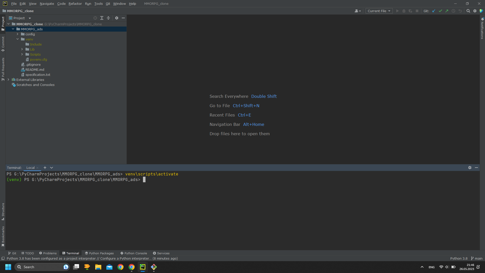

### Итоговый проект SKillFactory по блоку модулей D (Django framework) - доска объявлений для фанатского MMORPG-сервера.

---

__Техническое задание:__

"Нам необходимо разработать интернет-ресурс для фанатского сервера одной известной MMORPG —
что-то вроде доски объявлений. Пользователи нашего ресурса должны иметь возможность зарегистрироваться в нём по e-mail,
получив письмо с кодом подтверждения регистрации. После регистрации им становится доступно создание и
редактирование объявлений. Объявления состоят из заголовка и текста, внутри которого могут быть картинки,
встроенные видео и другой контент. Пользователи могут отправлять отклики на объявления других пользователей,
состоящие из простого текста. При отправке отклика пользователь должен получить e-mail с оповещением о нём.
Также пользователю должна быть доступна приватная страница с откликами на его объявления, внутри которой он может
фильтровать отклики по объявлениям, удалять их и принимать (при принятии отклика пользователю, оставившему отклик,
также должно прийти уведомление). Кроме того, пользователь обязательно должен определить объявление в одну из
следующих категорий: Танки, Хилы, ДД, Торговцы, Гилдмастеры, Квестгиверы, Кузнецы, Кожевники, Зельевары,
Мастера заклинаний.

Также мы бы хотели иметь возможность отправлять пользователям новостные рассылки."

---

#### __Запуск проекта:__
Т.к. данный проект разрабатывался на ОС Windows 11,
все нижеуказанные команды приведены для запуска проекта на такой же ОС.

1. Создаём директорию для проекта. Для этого можно воспользоваться
терминалом Git Bash:

2. Клонируем проект из удалённого репозитория на GitHub с помощью команды:

    > ___git clone https://github.com/n0fl3x/MMORPG_ads.git___

3. Открываем проект с помощью IDE (PyCharm, Visual Studio Code, и т.п.)

4. Открываем окно терминала и переходим в директорию проекта:

    > ___cd MMORPG_ads___

5. Создаём виртуальное окружение для проекта:

    > ___py -m venv venv___

6. Активируем виртуальное окружение:

   > ___venv\scripts\activate___

7. Переходим в директорию config:

    > ___cd config___

8. Устанавливаем необходимые для работы проекта зависимости
(на это уйдёт какое-то время, поэтому нужно будет немного подождать):

    > ___pip install -r requirements.txt___

9. В директории проекта создаём файл .env:

10. В .env файле необходимо вставить данные исходного проекта,
если у Вас есть к ним доступ (например если я ими с Вами поделился :) ).
Если доступа нет, то в данном файле нужно будет указать следующую информацию:
- DJANGO_SECRET_KEY = <Ваш секретный ключ Джанго>
- EMAIL_HOST_PASSWORD = <пароль приложения, задействующий отправку писем через Яндекс-почту>
- MY_EMAIL = <Ваш адрес электронной почты Яндекс, с которой будут отправляться письма>
- REDIS_KEY = <ключ-пароль для корректной обработки задач брокером Redis Cloud>
- PORT = <номер порта для корректной обработки задач брокером Redis Cloud>

11. Открываем 2 дополнительных окна терминала (т.е. всего их должно быть открыто три).
В каждом из них переходим в директорию проекта и активируем виртуальное окружение:

    > ___cd MMORPG_ads___

    > ___venv\scripts\activate___

12. В первом окне терминала запускаем Django-сервер:

    > ___py manage.py runserver___

13. Во втором окне терминала переходим в директорию config и
запускаем Celery для асинхронной обработки задач по отправке писем
(все письма должны приходить в текстовом формате именно в это окно терминала):

    > ___cd config___

    > ___celery -A config worker -l info -P threads --pool=solo___

14. В третьем окне терминала переходим в директорию config и
запускаем обработку периодических задач через Celery
(очистка неподтверждённых аккаунтов пользователей и
удаление неиспользованных кодов авторизации из БД):

    > ___cd config___

    > ___celery -A config beat -l info___

8. переходим по ссылке:

   > http://127.0.0.1:8000/ads/

Дальнейшее использование сайта должно быть интуитивно понятным.

Enjoy. :)
